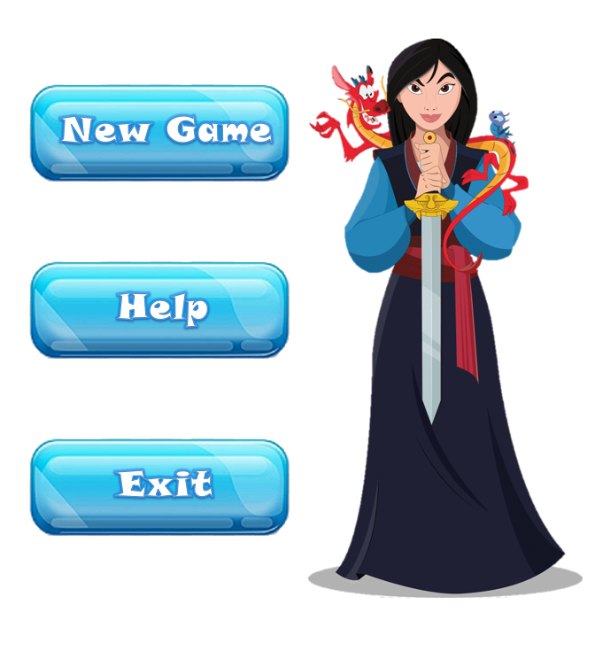
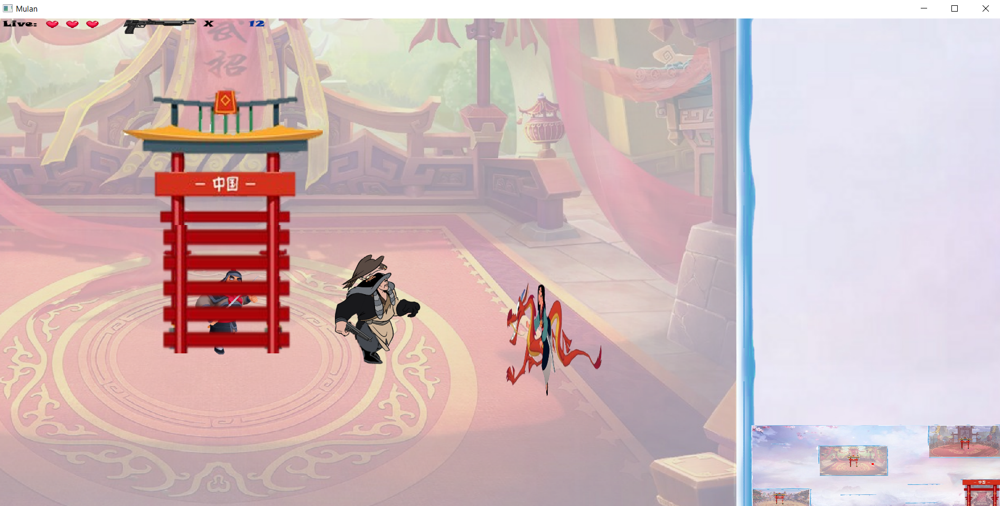
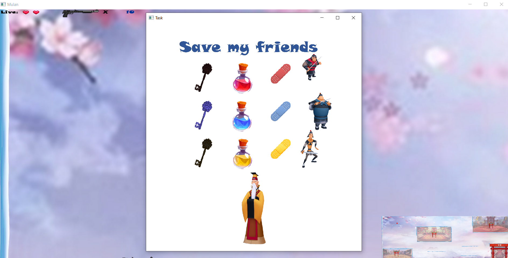
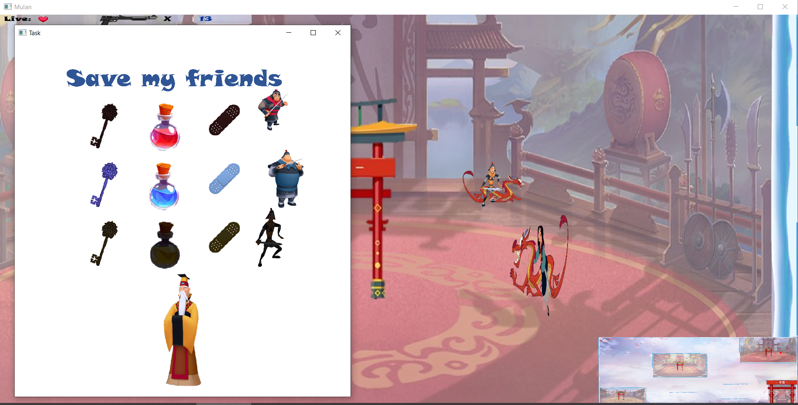

# Mulan-Save-My-Friend -Game

## General Overview:
This project involves developing the game "Mulan - Save My Friend".
## Objective and End of the Game:
The player's objective (as Mulan) is to rescue her friends from the enemies surrounding them from all directions, without being caught by the enemies, and to bring her friends to the king safely. The game continues as long as Mulan is not caught. Mulan has three lives. The game ends when all friends are brought to the king or when Mulan is caught by an enemy three times.

## Strict Adherence to OOP Principles:
This project places a strong emphasis on Object-Oriented Programming (OOP) principles to ensure high-quality, maintainable code. Each class is designed to have a single responsibility, following the principles of encapsulation, inheritance, and polymorphism.

## List of Created Files with Brief Descriptions:

- **Controller:** Encapsulates the entire program, including the `run` function that executes the entire program.
- **Level:** Manages each level, checks for victory conditions and collisions between Mulan and enemies, and handles the display of the level.
- **Board:** Reads data from the file and prints objects on the screen.
- **BaseObject:** Base class for all objects, both moving and static.
  - **MovingObject:** Base class for all moving objects.
    - **Player:** Base class for:
      - **Friend:** Class for friends that Mulan needs to rescue.
      - **Mulan:** Class for the player character Mulan.
    - **BaseEnemy:** Base class for two types of enemies:
      - **StupidEnemy:** Basic enemy.
      - **SmartEnemy:** Advanced enemy with intelligent movement.
    - **MovingWeapon:** Base class for moving weapons:
      - **Bullet:** Bullet class.
  - **StaticObject:** Base class for all static objects.
    - **Gift:** Base class for different types of gifts:
      - **LifeGift:** Adds life to Mulan (up to 3 lives).
    - **StaticWeapon:** Static weapon that Mulan can collect during the game.
    - **Gate:** Base class for gates:
      - **CityGate:** City gate, which requires a key to open.
      - **JailGate:** Jail gate, for each friend trapped in jail.
      - **KingGate:** King's gate, where Mulan brings the rescued friends.
    - **RescueTasks:** Base class for rescue items:
      - **Key:** Key to open the city gate.
      - **Plaster:** Plaster for rescuing a friend.
      - **Medication:** Medication for rescuing a friend.
- **Menu:** Displays the main game menu with buttons.
- **Button:** Manages the menu buttons. There are three types of buttons:
  - **StartNewGame:** Starts a new game.
  - **Help:** Displays help and game instructions. Clicking it opens a new window with instructions.
  - **Exit:** Exits the game.
- **InformationDisplay:** Manages the secondary menu that shows game data.
- **TaskManager:** Manages the rescue tasks for saving friends.
- **TasksDisplay:** Feature within TaskManager that displays the "rescue items" Mulan collects during the game.
- **Subject:** Defines an entity that can be observed, such as Mulan.
- **Observer:** Defines an observer, which in this case is the Information Display.
- **Resources:** Contains all game resources, such as images, sounds, texts, etc.
- **Utilities:** Contains constants.
- **ColorItem:** Base class for classes that represent objects differentiated by color.

## Main Data Structures and Their Roles:
- `vector <unique_ptr<StaticObject>> m_statObjects`: For static objects.
- `vector <unique_ptr<BaseEnemy>> m_enemy`: For enemies.
- `unique_ptr<Player> m_mulan`: For Mulan.
- Additional vectors are used in the `Resources` class.
- `std::vector<std::pair<int, std::shared_ptr<BaseObject>>> m_mission`: For game missions.

## Noteworthy Algorithms:
- Use of Factory pattern.
- Observer pattern.
- Intelligent movement algorithm for the smart enemy.
- Movement of Mulan using view.
- MiniMap displayed throughout the game.
- Multiple inheritance.
- Task management with smart display.

## Design:
After selecting "Start New Game" in the main menu, the `Controller` starts a new game, builds the level, and manages it. The level is created in the `Level` class, which is responsible for the player's movements, enemy movements, and all collisions (using multiple method dispatch).

## Known Bugs:
None at the moment.

## Other Comments:
- Music plays throughout the game, with specific tracks for victory and defeat.
- Animations were created for the player character, smart enemy, and stupid enemy.

## SFML Library:
We used the SFML library for graphics and sound. Follow these instructions to install and use SFML version 2.5.1 to ensure proper compilation:

1. Download the SFML library from the [official website](https://www.sfml-dev.org/download/sfml/2.5.1). The direct link for the 64-bit Visual C++ 2017 file is [here](https://www.sfml-dev.org/files/SFML-2.5.1-windows-vc15-64-bit.zip).
2. Extract the downloaded file into a folder named `SFML` in your `C:` drive. After extraction, you should have a folder structure like `C:\SFML\SFML-2.5.1` with subfolders such as `bin`, `include`, `lib`, etc.

## Pictures from the game:

